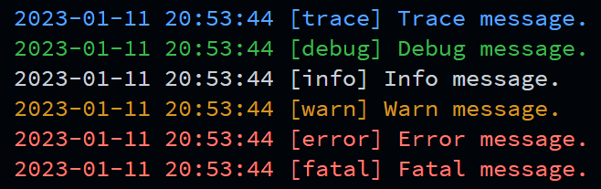

# simple_logger



## Introduction

`simple_logger`, a simple, multifunctional and header-only log library for C++17.

## Highlights

+ :white_check_mark: Simple: Header-only, easy and convenient to use​
+ :white_check_mark: Multiple styles to use: C++ `iostream` style, function style and ​format style
+ :white_check_mark: High performance: Templatized, no runtime polymorphism
+ :white_check_mark: Customizable thread-safety: Provide both thread-safe and thread-unsafe mode. No extra performance overhead in thread-unsafe mode.

## Supported Platform

+ Unix-like Operating Systems (Linux, MacOS, FreeBSD, ...)
+ Windows x86/x64 (MSVC, MinGW, MinGW-w64, Cygwin, ...)
+ ...

## Supported Compiler

MSVC, GCC and Clang, etc. supporting **C++17 standard or above**.

## Clone this Repository

Run:

```shell
$ git clone https://github.com/Timothy-Liuxf/simple_logger.git --recursive
```

or

```shell
$ git clone https://github.com/Timothy-Liuxf/simple_logger.git
$ cd simple_logger
$ git submodule update --init --recursive
```

## Get Started

`simple_logger` is a header-only library and needn't to be built. Just add the `include` and `third_party/fmt/include` directories into the *include directories* of your C++ project and include `simple_logger/simple_logger.hpp` to get started.

### Log Levels

There are six log levels in `simple_logger`: `Trace`, `Debug`, `Info`, `Warn`, `Error` and `Fatal`. The first two levels will print log messages into `stdout`, while the other two will print into `stderr`. By default, log messages in `Debug` level and `Trace` level are **NOT** printed.

### Quick Start

There are three styles to log messages.

#### C++ Style

You can log messages in C++ `iostream` style:

```c++
#include <simple_logger/simple_logger.hpp>

using namespace simple_logger;

int main() {
  logger.Trace() << "This message shouldn't be printed by default!";
  logger.Debug() << "This message shouldn't be printed by default!";
  logger.Info() << "Info message: <" << 8888 << '>';
  logger.Warn() << "Warn message: <" << 8888 << '>';
  logger.Error() << "Error message: <" << 8888 << '>';
  logger.Fatal() << "Fatal message: <" << 8888 << '>';
  return 0;
}
```

#### Function Style

You can also log messages just as a variadic function:

```c++
#include <simple_logger/simple_logger.hpp>

using namespace simple_logger;

int main() {
  logger.Trace("This message shouldn't be printed by default!");
  logger.Debug("This message shouldn't be printed by default!");
  logger.Info("Info message: <", 8888, '>');
  logger.Warn("Warn message: <", 8888, '>');
  logger.Error("Error message: <", 8888, '>');
  logger.Fatal("Fatal message: <", 8888, '>');
  return 0;
}
```

#### format style

You can also log messages in C++20 format library style:

```c++
#include <simple_logger/simple_logger.hpp>

using namespace simple_logger;

int main() {
  logger.Tracef("This message shouldn't be printed by default!");
  logger.Debugf("This message shouldn't be printed by default!");
  logger.Infof("Info message: <{}>", 8888);
  logger.Warnf("Warn message: <{}>", 8888);
  logger.Errorf("Error message: <{}>", 8888);
  logger.Fatalf("Fatal message: <{}>", 8888);
  return 0;
}
```

### Format multiple objects

With [fmtlib](https://fmt.dev), `simple_logger` can support almost all formatting methods in fmtlib. Such as:

1. Format ranges:

   ```c++
   #include <simple_logger/simple_logger.hpp>
   
   #include <fmt/ranges.h>
   #include <array>
   
   using namespace simple_logger;
   
   int main() {
     std::array arr {0, 1, 2, 3};
     logger.Infof("Info message: {}", arr);
     return 0;
   }
   ```

2. Format time:

   ```c++
   #include <simple_logger/simple_logger.hpp>
   
   #include <fmt/chrono.h>
   #include <chrono>
   
   using namespace simple_logger;
   
   int main() {
     auto current_time = fmt::localtime(
         std::chrono::system_clock::to_time_t(std::chrono::system_clock::now()));
     logger.Infof("Info message: current_time: {:%Y-%m-%d %H:%M:%S}",
                  current_time);
     return 0;
   }
   ```

3. Literal-based format

   ```c++
   #include <simple_logger/simple_logger.hpp>
   
   #include <fmt/format.h>
   
   using namespace simple_logger;
   
   int main() {
     using fmt::literals::operator""_a;
     logger.Infof("Info message: {num}", "num"_a = 5);
     return 0;
   }
   ```

4. For more usage, please see [fmtlib API documentation](https://fmt.dev/latest/api.html).

### Specify Log Levels

To specify log levels, you should define the following macros before including `simple_logger/simple_logger.hpp`:

+ `SIMPLE_LOGGER_DISABLE_LOG`: No logs will be printed
+ `SIMPLE_LOGGER_ENABLE_LOG_TRACE`: Log messages on `Trace`, `Debug`, `Info`, `Warning`, `Error` and `Fatal` levels will be printed
+ `SIMPLE_LOGGER_ENABLE_LOG_DEBUG`: Log messages on `Debug`, `Info`, `Warning`, `Error` and `Fatal` levels will be printed
+ `SIMPLE_LOGGER_ENABLE_LOG_INFO`: Log messages on `Info`, `Warning`, `Error` and `Fatal` levels will be printed
+ `SIMPLE_LOGGER_ENABLE_LOG_WARN`: Log messages on `Warning`, `Error` and `Fatal` levels will be printed
+ `SIMPLE_LOGGER_ENABLE_LOG_ERROR`: Log messages on `Error` and `Fatal` levels will be printed
+ `SIMPLE_LOGGER_ENABLE_LOG_FATAL`: Only log messages on `Fatal` level will be printed
+ If no macro is defined, it behaves just as `SIMPLE_LOGGER_ENABLE_LOG_INFO` is defined

### Thread Safety

The log object `logger` is thread-safe. To use thread-unsafe log to avoid improve performance, you can use `uslogger`. For an example, the following code will cause chaos (changing `uslogger` to `logger` would fix it):

```c++
#include <simple_logger/simple_logger.hpp>

#include <memory>
#include <thread>
#include <utility>
#include <vector>

constexpr std::size_t nthreads = 128;

using namespace simple_logger;

int main(int argc, char*[]) {
  std::vector<std::unique_ptr<std::thread>> threads(nthreads);
  for (std::size_t i = 0; i < nthreads; ++i) {
    threads[i] = std::make_unique<std::thread>([i, argc] {
      std::this_thread::yield();
      uslogger.Info() << "Thread-unsafe "
                      << "log. "
                      << "[argc: " << argc << "] "
                      << "At "
                      << "Index: " << i << ".";
    });
  }
  for (std::size_t i = 0; i < nthreads; ++i) {
    threads[i]->join();
    threads[i].reset();
  }
  return 0;
}
```

## Build Examples

Source code of the examples are in the `examples` directory.

To build the examples:

For all platforms with **CMake**, run:

```shell
$ mkdir build
$ cd build
$ cmake ..
$ make -j$(nproc)
```

For Unix-like platforms with **GNU Autotools**, run:

```shell
$ autoreconf -i
$ ./configure
$ make -j$(nproc)
```

To run the examples, then run:

```shell
$ ./examples/<example_name>
```

The `<example_name>` is the same as the name of the corresponding source file after removing the extension name `.cc`.

## Author

Copyright (C) 2023, [Timothy Liu](https://github.com/Timothy-Liuxf)

All rights reserved

## LICENSE

[MIT License](https://github.com/Timothy-Liuxf/simple_logger/blob/master/LICENSE.txt)

